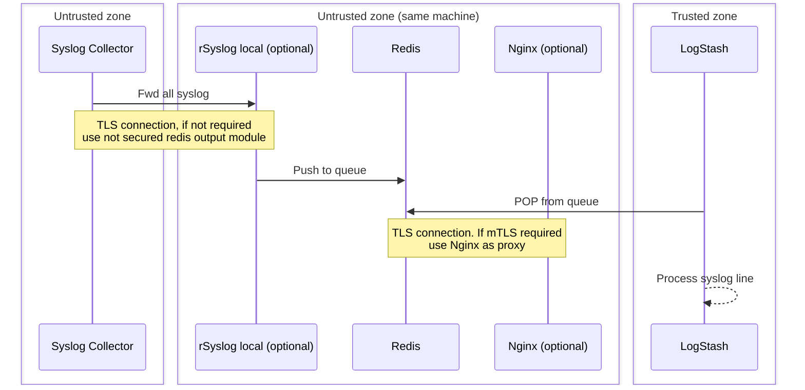

# Repository goals
The purpose of this repository is to PoC a solution where a logstash instance (to which no incoming connection are allowed) must parsed some syslog coming from a remote point.
## Intro
As the logstash instance cannot receive any input from the selected syslog server (security pre-req), a mediation software has be able to serve the data to the logstash instance. The following solution is testing Redis, as follows:

## Prerequisite
In order to allow Logstash to communicate with Redis using TLS socket, the certificate MUST be signed by an authorized CA.
If you do not have a valid certificate generate it like this:
```bash
// Generate private key & root certificate for the CA
$ openssl req -x509 -newkey rsa:4096 -keyout myCA.key -out myCA.pem -sha256 -days 3650 -nodes -subj "/C=FR/ST=IDF/L=Paris/O=PoC/OU=Team/CN=myCA"

// Generate redis server own certificate, where CN value must match the FQDN of the redis address
$ openssl req -x509 -newkey rsa:4096 -keyout redis-tls.key -out redis-tls.pem -sha256 -days 3650 -nodes -subj "/C=FR/ST=IDF/L=Paris/O=PoC/OU=Team/CN=redis-col"

$ openssl req -new -key redis-tls.pem -out request.csr

$ openssl x509 -req -days 3650 -in request.csr -signkey redis-tls.pem -extfile extensions.txt -out redis-tls-signed.pem

// Copy the private key & public signed cert for the redis server:
$ cp redis-tls-signed.pem redis-tls.key service-redis/config/
// Copy the pub cert of the CA for the logstash instance
$ cp myCA.pem service-logstash/

```
## How to use
```bash
// Setup the environment
$ docker-compose build --force-rm #--no-cache
$ docker-compose up -d

// Launch a unit-test
$ tail -f services-logstash/logs/output.log
$ logger -n 127.0.0.1 -T -P 5514 -p "alert" "any text that you want to match and send over the syslog then redis then logtstah for printing"

// Check the completness of messages (check if no one are lost)
$ echo -n "" | sudo tee service-logstash/logs/output.log
$ for run in {1..100000}; do logger -n 127.0.0.1 -T -P 5514 -p "alert" "any text that you want to match and send over the syslog then redis then logtstah for printing"; done
$ wc -l service-logstash/logs/output.log
```
__WARNING__: For unknown reasons, ~7% of line lost were spotted
--> Need to enhance perf test & quality test

## How to debug
```bash
$ docker-compose logs logstash
$ docker ps # look for the running "CONTAINER ID" targeted
$ docker exec -it XXX_CONTAINER_ID_XXX bash
```

